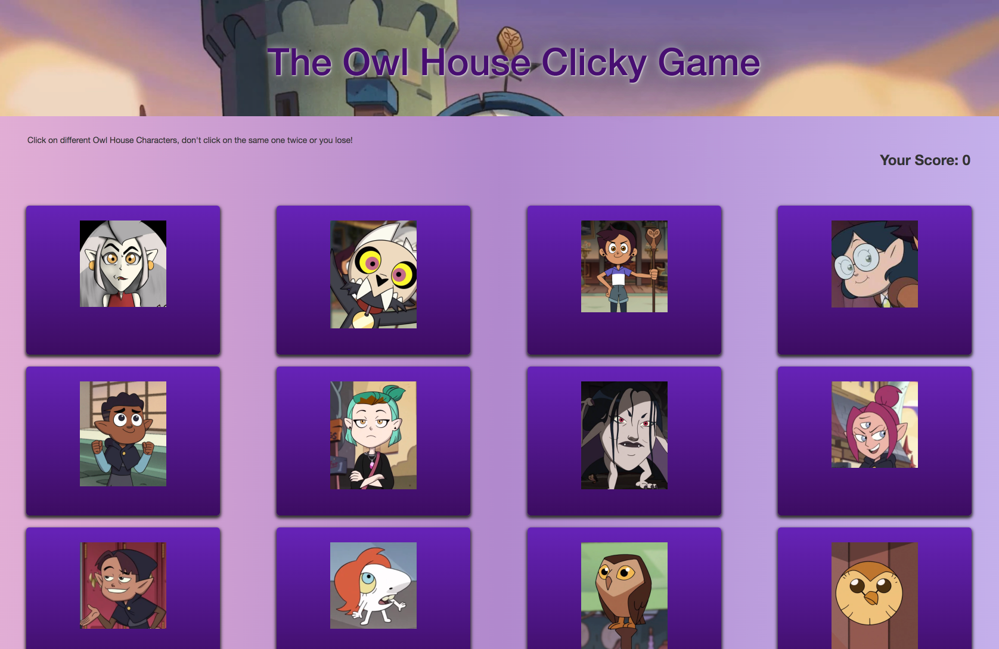
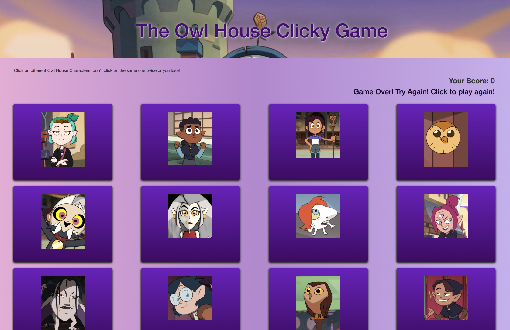

# 19-React-Clicky_Game

### Deployed to Heroku

## Setup of Application

### Creating App

  `npm init react-app my-app`

### Build App

  `npm run build`

### Technologies Used
- React
- ReactDOM
- Node.js

## Game Setup Instructions
- The application should render different images to the screen. Each image should listen for click events.
- The application keeps track of the user click to keep score. It will increment with each correct click. The score will be reset to 0 if the same image is clicked more than once.
- With each click the image will shuffle in a random order.
- Once the user's score is reset to 0 with an incorrect guess, the game will restart.

## Game Screenshots
* Owl House Theme

* Win

* Lose

